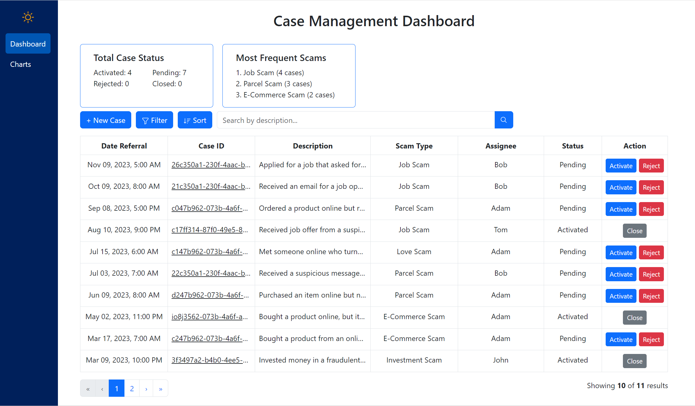

<h1 align="center">ScamWatch🔍</h1>

## Description

ScamWatch is a tool built for <a href="www.htx.gov.sg">HTX Gov.SG</a> to assist police investigators in the fight against scams. It provides scam case file management features, data visualisation charts, and simple scam statistics.

<p align="center">

</p>

## 🛠️&nbsp;Tools Used For This Project

<p align="left">
<a href="https://www.typescriptlang.org/"></a>
<a href="https://react.dev/"></a>
<a href="https://react-bootstrap.netlify.app/"></a>
</p>

## 🚀&nbsp;Getting Started

First, run the command in the terminal to install all of the dependencies you need:

```bash
npm install
```

Next, to run the development server:

```bash
npm start
```

Open [http://localhost:3000](http://localhost:3000) with your browser to see the result.

> **Note**
> API endpoints are not configured and mock data is provided due to confidentiality.

## Features

### 📂&nbsp;Case file management

- Create, View, Edit case
  - Accepts file uploads with extensions `PDF`, `docx`, `pptx`, `xslx`, `PNG`, `JPG`
- Multi Filter, Search
  - By `Status`, `Start & End Date`, `Description`
- Sort
  - By `Date`
- Pagination

### 📈&nbsp; Data visualisation charts

- Fund Flow Chart
- Fund Recovery Chart
- Typography Recovery Chart

### 🔢&nbsp;Simple scam statistics

- Total Case Status
- Most Frequent Scams
- Number of Loaded Results

### ⚙&nbsp;Customisability

- Dark theme
- Mobile responsive
